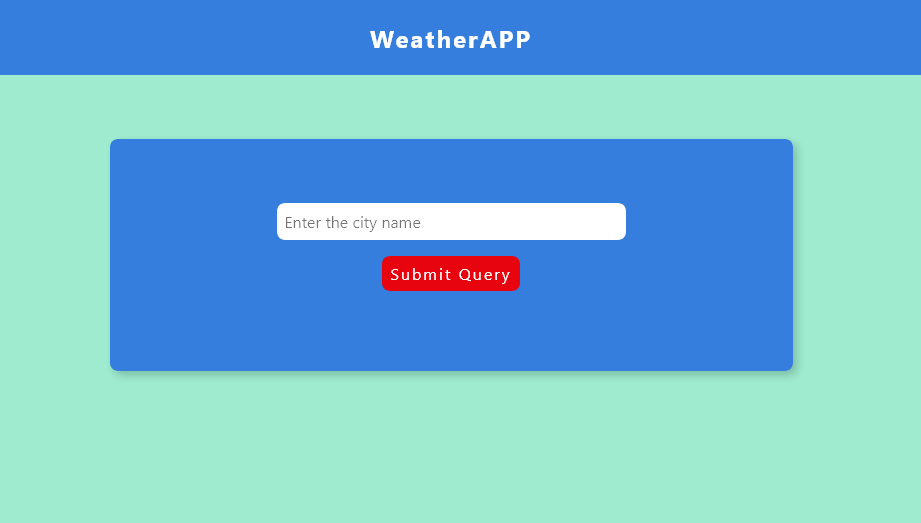
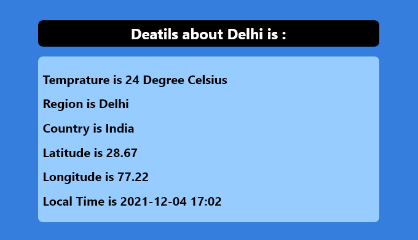

# WeatherAPP
A NodeJS App using Weather API to get details about entered city.

 
This is a city details app in ExpressJS, made by Ram Goel.

Working: 

Whenever you open the site you will see an option to enter city name and when you enter city name you will get some dtails balout the city you have entered. The details are being fetched by an WEATHER API.
 

Technologies Used:
Express JS for Backend,
HTML, CSS for Frontend

NPM Packages:
body-parser for form parsing,
ejs for template engine,
path for path functionality,
nodemon for not to restart server everytime,
request for API

If you are running this on your local machine then just download the code or clone the repository into a folder and open terminal or cmd there, and then type

npm i body-parser nodemon ejs request

after installation, type nodemon index.js
